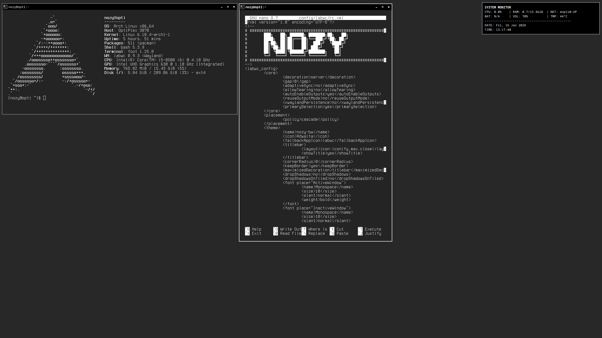

# labwc-dotfiles
this repository contains the configuration files (.files) for labwc which is a wlroots-based window-stacking compositor for Wayland <br>

packages <br>
```
sudo pacman -Syu wayland wayland-protocols labwc xdg-desktop-portal xdg-desktop-portal-wlr vulkan-intel vulkan-mesa-layers intel-media-driver dbus acpid polkit-gnome xdg-user-dirs foot alacritty bash-completion swaybg mako libnotify kanshi grim slurp nwg-look noto-fonts noto-fonts-cjk noto-fonts-emoji terminus-font ibus gnome-themes-extra xcursor-vanilla-dmz firefox chromium geany viewnior fastfetch zip unzip
```

use labwc with systemd-logind instead of seatd, seatd is dependency for labwc, currently i see harmless warning spams in tty with seatd

add below line in you ~/.bashrc
```
alias labwc='labwc 2>/dev/null'
```

```
sudo usermod -aG video,input <username>
```

place bin folder under ~/.local/
place themes under ~/.themes
place fastfetch, foot, labwc mako in ~/.config folder

this config is using foot as terminal emulator, but install alacritty as it is fallback / default emulator for labwc

Note: make all the scripts in bin folder executable

optional packages - waybar & wofi

I have also included configs for waybar and wofi - here in my setup i have not used waybar and wofi, but can easily setup by making changes to rc.xml and autostart scripts inside labwc


