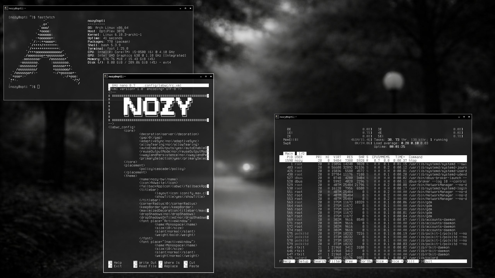

# labwc-dotfiles
wlroots-based window-stacking compositor for Wayland

packages <br>
```
sudo pacman -Syu wayland labwc foot alacritty swaybg libnotify mako viewnior firefox chromium noto-fonts noto-fonts-cjk noto-fonts-emoji geany xcursor-vanilla-dmz gnome-themes-extra
```

place bin folder under ~/.local/
place themes under ~/.themes
place fastfetch, foot, labwc mako in ~/.config folder

this config is using foot as terminal emulator, but install alacritty as it is fallback / default emulator for labwc

Note: make all the scripts in bin folder executable

optional : waybar and wofi - here in my setup i have not used waybar and wofi, but can easily setup by making changes to rc.xml and autostart scripts inside labwc



